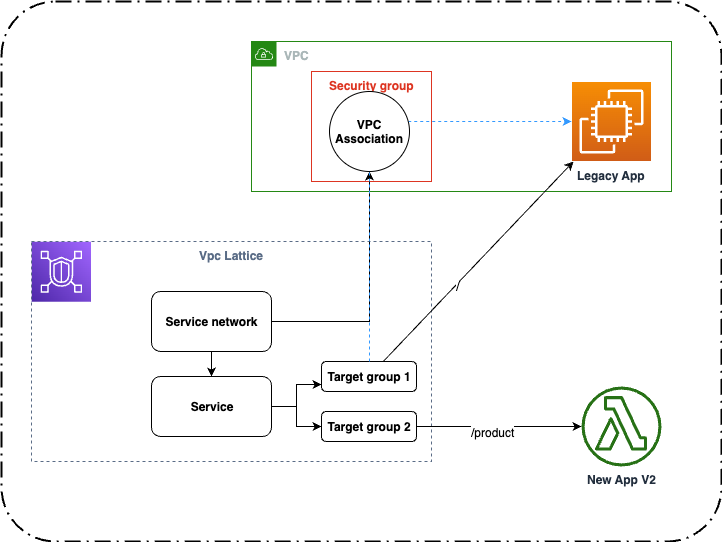

# AWS VPC Lattice deployment with a CloudFormation Template

## About this Repo <a name="About"></a>
This repository contains an example of how use Vpc Lattice to Strangle your legacy application deployed in EC2. 
A lot of times throughout startup journey, there is a clear requirement for speed and experimentation. Once the feasibility, usage and MVP are proven, engineering teams will pivot to scaling goals. often times is a non trivial task to refactor your architecture and break your monolith in smaller chunks while reducing risk of downtime.

VPC Lattice is a great new service that not only allows a lot of the network complexitites to be abstrated away from your application integrations, but it also offers routing, which can be used to strangle traffic from your monolith, while having the possibility to easily revert back traffic in case of issues start to be observed. 

This set of 3 cloudformation templates are broken down by a ilustrative representation of the legacy system (cfn-legacy-product), new service running on Lambda (cfn-new-product) and a template which spin ups the most important resources to bare minimum, functional VPC lattice setup.



## Contraints

1) This example is built under the premise that a vpc (the traditional one) is already setup.
2) For demonstration purposes, the legacy-product template was generated so you could run these templates in your own account and see how it works. In a real world situation, the legacy environment has been already setup and you just have to feed in the details in the parameter section.
3) The VPC this has been developed had 172.x.x.x CIDR range, please modify the parameter according to your own VPC configuration.
4) This architecture will not work with stateful applications. If your application requires stateful requests, consider using [ALB] (https://docs.aws.amazon.com/elasticloadbalancing/latest/application/sticky-sessions.html). 

### Official Resources
- [Cloud Formation references](https://docs.aws.amazon.com/AWSCloudFormation/latest/UserGuide/AWS_VpcLattice.html)
- [Strangler original Martin Fowler's article](https://martinfowler.com/bliki/StranglerFigApplication.html)
- [Work with prefix lists] (https://docs.aws.amazon.com/vpc/latest/userguide/working-with-aws-managed-prefix-lists.html)
- [AWS CloudFormation CLI](https://awscli.amazonaws.com/v2/documentation/api/latest/reference/cloudformation/index.html)

## Pre requisites

1. [AWS CLI installed](https://docs.aws.amazon.com/cli/latest/userguide/getting-started-install.html)
2. Access to an AWS account
3. [Credentials configured](https://docs.aws.amazon.com/cli/latest/userguide/cli-chap-configure.html)
4. [git installed on your environment](https://git-scm.com/book/en/v2/Getting-Started-Installing-Git)

## Deployment Instructions

1. Create a new directory, navigate to that directory in a terminal and clone the GitHub repository:
    ``` 
    git clone https://github.com/aws-samples/add-the-repo-here
    ```
2. Modify the param-legacy-product.json file to be based on your local environment
3. From the command line, use AWS CLI to deploy the first cloudformation template. This template will deploy a mock legacy application (plain nginx) in EC2 box.
    ```
    aws cloudformation deploy --template-file cfn-legacy-product.yaml --stack-name product-legacy --parameter-overrides "$(cat param-legacy-product.json)" --capabilities CAPABILITY_IAM
    ```
4. From the command line, use AWS CLI to deploy the second cloudformation template. This template will deploy a mock new application in lambda.
    ```
   aws cloudformation deploy --template-file cfn-new-product.yaml --stack-name new-product-stack --capabilities CAPABILITY_NAMED_IAM
    ```
5. Look into the outputs of both stacks that have been deployed and replace the values in paral-lattice.json with the ones displayed in outputs section.

6. From the command line, use AWS CLI to deploy the third cloudformation template. This template will setup Vpc Lattice targets.
    ```
   aws cloudformation deploy --template-file cfn-lattice-basic.yaml --stack-name vpc-lattice-stack --parameter-overrides "$(cat param-lattice.json)"   
    ```


## Testing

1. Using the output from the third CFN stack you created, collect domain url and use it to hit it using curl, or your http IDE of choice. You should see different outputs depending of url matching

----

## How to deploy the CFN Templates

aws cloudformation deploy --template-file cfn-new-product.yaml --stack-name new-product-stack --capabilities CAPABILITY_NAMED_IAM

aws cloudformation deploy --template-file cfn-legacy-product.yaml --stack-name product-legacy --parameter-overrides "$(cat ./param-input/param-legacy-product.json)" 

aws cloudformation deploy --template-file cfn-lattice-basic.yaml --stack-name vpc-lattice-stack --parameter-overrides "$(cat ./param-input/param-lattice.json)"   

# License <a name="License"></a>

This library is licensed under the MIT-0 License.

# FAQ

Q:I am not being able to hit the service domain from my test environment. Why?

If you are hitting the domain from your VPC, most likely you have to allow inbound traffic from the resource you are doing it. If it is an EC2 box, add a new inbound rule refering its security group in the security group tied to the VPC association within the VPC lattice service network.
Furthermore make sure the reference of the prefix list is the correct one, you can run the following command on the AWS CLI
```
aws ec2 describe-managed-prefix-lists --filters Name=owner-id,Values=AWS
```
